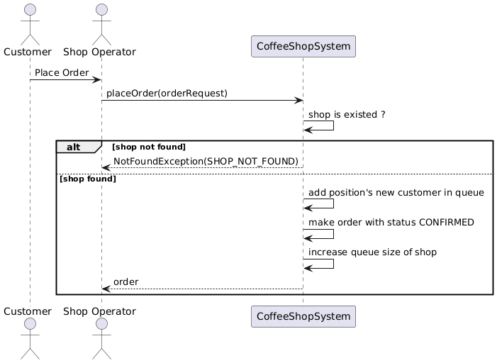
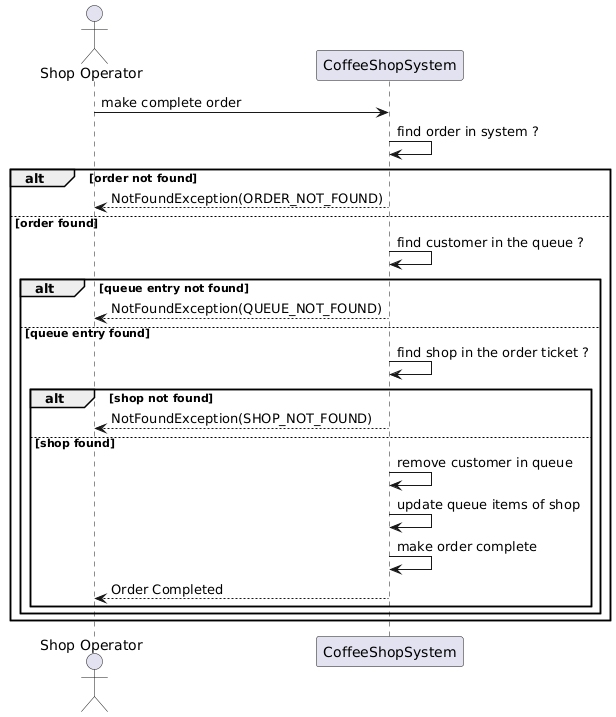
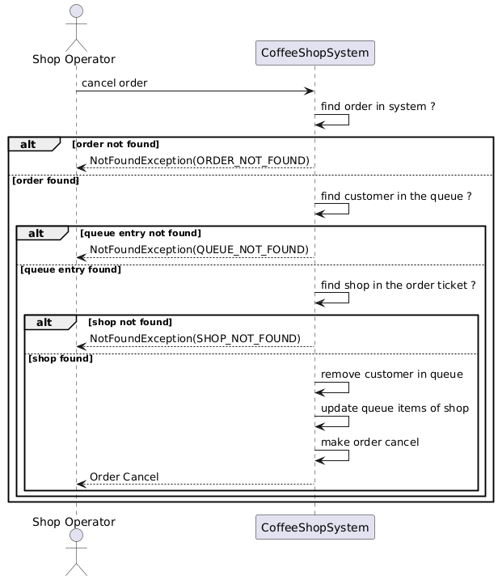

# Coffee Shop Customer App Solution Design

## Use Cases
1. **Customer Registration**: Allows customers to register with their mobile number, name, and address.
2. **View Nearby Coffee Shops**: Allows customers to view and find coffee shops closest to them.
3. **Place Order**: Allows customers to place an online order for coffee from the menu.
4. **View Queue Position**: Allows customers to see their position in the queue and expected waiting time.
5. **Exit Queue**: Allows customers to exit the queue and notify the shop to cancel the order.

## Sequence Diagrams

#### Place order



### Complete order


### Cancel order


## Data Designs

### Customer Table

The `customer` table stores information about customers.

| Column        | Type          | Constraints                         |
|---------------|---------------|-------------------------------------|
| id            | BIGINT        | Primary Key, Auto Increment         |
| name          | VARCHAR(255)  |                                     |
| mobile_number | VARCHAR(255)  | Unique                              |
| address       | VARCHAR(255)  |                                     |
| create_date   | TIMESTAMP     | Default: CURRENT_TIMESTAMP          |
| update_date   | TIMESTAMP     | Default: CURRENT_TIMESTAMP          |

### Orders Table

The `orders` table stores information about orders placed by customers.

| Column        | Type          | Constraints                         |
|---------------|---------------|-------------------------------------|
| id            | BIGINT        | Primary Key, Auto Increment         |
| customer_id   | BIGINT        |                                     |
| shop_id       | BIGINT        |                                     |
| order_details | JSON          |                                     |
| status        | VARCHAR(50)   |                                     |
| create_date   | TIMESTAMP     | Default: CURRENT_TIMESTAMP          |
| update_date   | TIMESTAMP     | Default: CURRENT_TIMESTAMP          |

Indexes:
- `customer_id`
- `shop_id`

### Shop Table

The `shop` table stores information about shops.

| Column           | Type          | Constraints                         |
|------------------|---------------|-------------------------------------|
| id               | BIGINT        | Primary Key, Auto Increment         |
| name             | VARCHAR(255)  |                                     |
| location         | VARCHAR(255)  |                                     |
| contact_details  | VARCHAR(255)  |                                     |
| menu             | JSON          |                                     |
| queues           | INT           |                                     |
| opening_time     | TIME          |                                     |
| closing_time     | TIME          |                                     |
| version          | INT           | Default: 1                          |
| create_date      | TIMESTAMP     | Default: CURRENT_TIMESTAMP          |
| update_date      | TIMESTAMP     | Default: CURRENT_TIMESTAMP          |

### Queue Table

The `queue` table stores information about customer queues in shops.

| Column        | Type          | Constraints                         |
|---------------|---------------|-------------------------------------|
| id            | BIGINT        | Primary Key, Auto Increment         |
| shop_id       | BIGINT        |                                     |
| customer_id   | BIGINT        |                                     |
| position      | INT           |                                     |
| create_date   | TIMESTAMP     | Default: CURRENT_TIMESTAMP          |
| update_date   | TIMESTAMP     | Default: CURRENT_TIMESTAMP          |

Indexes:
- `shop_id`
- `customer_id`

## API Endpoints

### Place order
To place an order, use the following `curl` command:

```sh
curl --location 'http://localhost:8080/orders' \
--header 'Content-Type: application/json' \
--data '{
  "customerName": "Tester 2",
  "customerPhone": "0987654321",
  "shopName": "Coffee Shop 2",
  "orderDetails": {
    "items": [
      {
        "name": "Coffee",
        "quantity": 1
      },
      {
        "name": "Espresso",
        "quantity": 1
      }
    ]
  }
}'
```

Response
The response will be in the following format:

```json
{
  "orderId": 2,
  "status": "PLACED"
}
```

### Complete order

To complete an order, use the following `curl` command:

```sh
curl --location --request POST 'http://localhost:8080/orders/4/complete' \
--data ''
```

Response
The response will be in the following format:

```json
{
  "orderId": 4,
  "status": "COMPLETED"
}
```